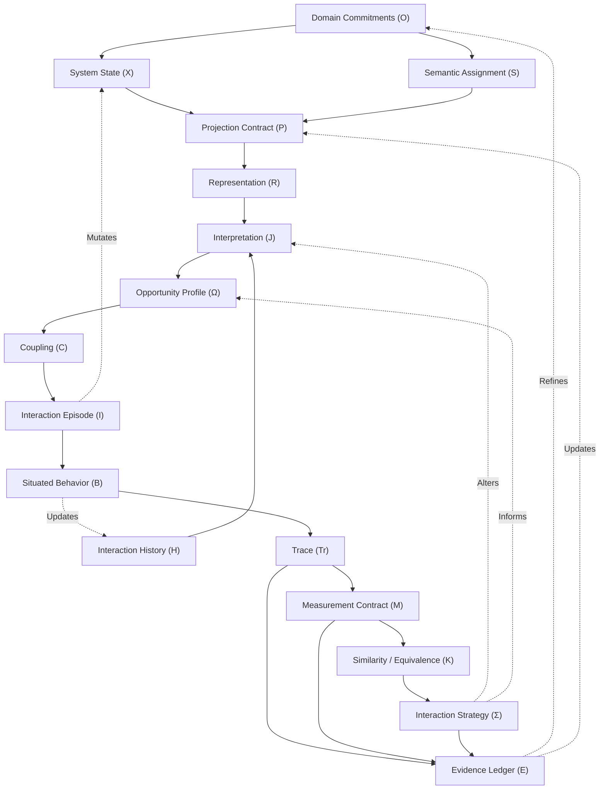

# Deliverable 07: Concept Dependency Graph

**Program:** Computational Interaction Science (CompInt)  
**Date:** 2026-07-17  
**Status:** Methodological Protocol  

This document visualizes the analytical dependencies, feedback loops, and conceptual boundaries of Computational Interaction Science (CompInt) using a formal Mermaid diagram.

---

## 1. The Dependency Graph

---

## 2. Explanation of Layers and Flows

### 2.1 The Downward Analytical Flow (Forward Pass)
The solid arrows show how concepts depend logically on their predecessors for definition and evaluation:
1.  **Foundations ($O \rightarrow X, S$):** You cannot define a system state ($X$) or semantic transitions ($S$) without first declaring the domain commitments ($O$).
2.  **Projection and Representation ($X, S \rightarrow P \rightarrow R$):** The projection contract ($P$) maps system elements to a visible representation ($R$).
3.  **Epistemic Access ($R, H \rightarrow J \rightarrow \Omega$):** The user interprets ($J$) the representation based on their prior interaction history ($H$), which forms the subjective side of their opportunity profile ($\Omega$).
4.  **Operational Coupling ($\Omega \rightarrow C \rightarrow I \rightarrow B \rightarrow Tr$):** The opportunity profile structures how systems couple ($C$), yielding an interaction episode ($I$), which displays behavior ($B$) and leaves a trace ($Tr$).
5.  **Scientific Inference ($Tr \rightarrow M \rightarrow K \rightarrow \Sigma \rightarrow E$):** The trace is measured ($M$), compared via similarity ($K$), modeled as a strategy ($\Sigma$), and filed as evidence ($E$).

### 2.2 The Upward Feedback Loops (Dynamic Recurrence)
The dashed arrows show how execution and learning alter system states and user expectations over time:
*   **State Loop ($I \rightarrow X$):** Actions performed in the interaction episode modify the system state, triggering a new projection pass.
*   **Adaptation Loop ($B \rightarrow H$):** The outcomes and errors of situated behavior accumulate in the user's interaction history, changing how they interpret future representations.
*   **Strategy Loop ($\Sigma \rightarrow \Omega, J$):** A chosen strategy reorganizes what information the user seeks (changing interpretation) and what actions they select from the opportunity profile.
*   **Refinement Loop ($E \rightarrow O, P$):** Validated scientific evidence is used by researchers to refine domain commitments and optimize projection contracts.
