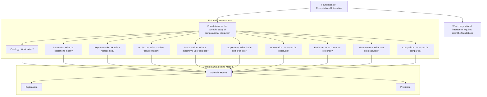

# Editorial Repositioning Analysis

**Version:** 1.0.0  
**Status:** Completed Analysis and Deliverable Record  
**Guiding Principle:** The contribution is not an explanatory or predictive theory of computational interaction. It is an **epistemic infrastructure for the scientific study of computational interaction**, specifying the conditions under which interactions can be represented, observed, measured, compared, and modeled.

---

## 1. Reframed Scientific Motivation

The opening motivation of the scholarly program is reframed from a simple disciplinary gap to a fundamental epistemological problem:

> *Computational interaction currently lacks a common epistemic foundation. Without agreement on what interactions are, how they are represented, what observations are admissible, what constitutes evidence, and what measurements are valid, downstream explanations and predictions remain difficult to compare, reproduce, or accumulate.*

This motivation naturally justifies the structural hierarchy of the subsequent chapters. Each component is designed to answer a necessary epistemological question to make computational interaction scientifically analyzable.

---

## 2. The 12-Chapter Epistemological Progression

To establish a logical progression from baseline motivation to downstream application, the 16 existing foundational papers are reordered and consolidated into the following 12-chapter scientific program structure:

| Chapter | Epistemological Question | Paper Source Mapping | Role in the Epistemic Infrastructure |
|---|---|---|---|
| **1. Motivation** | *Why do we need a foundation?* | Papers 1, 2, 3 | Establishes the necessity of a shared epistemic foundation for interaction. |
| **2. Ontology** | *What exists?* | Paper 5 (Ontology section) | Defines foundational entities (state, action, participant) and relations. |
| **3. Semantics** | *What do operations mean?* | Paper 5 (Semantics section) | Specifies transition rules, capability, and permission predicates. |
| **4. Representation** | *How is it represented?* | Paper 4 (Representation section) | Formulates target state configurations and layout attributes. |
| **5. Projection** | *What survives transformation?* | Paper 4 (Projection section) | Establishes structural mapping invariants, signifiers, and signals. |
| **6. Interpretation** | *What is system vs. user purpose?* | Paper 5 (Interpretation section) | Separates explicit system actions from latent user intent. |
| **7. Opportunity** | *What is the unit of choice?* | Paper 6 (Opportunity profile) | Establishes opportunity as a typed action-availability profile — the structure over which choice is analyzed, not a measurement unit. |
| **8. Observation** | *What can be observed?* | Paper 8 (Behavioral traces) | Formulates coding rules for converting raw actions into structured traces. |
| **9. Evidence** | *What counts as evidence?* | Handbooks (Experimental & Replication) | Specifies lineage verification, replication protocols, and bias checks. |
| **10. Measurement** | *What can be measured?* | Paper 9 (Measurement framework) | Specifies metrics, coding invariants, and scaling parameters. |
| **11. Comparison** | *What can be compared?* | Papers 10, 11, 12, 15 | Compares interactions across differing morphologies and transfer histories. |
| **12. Scientific Models** | *How is it modeled?* | Papers 13, 14, 16 | Downstream consumers (Explanation & Prediction) built within the framework. |

---

## 3. Paper Contribution Dependency Map

The revised dependency map explicitly separates the **Foundational Epistemic Infrastructure** from downstream **Scientific Models** (Explanation and Prediction):

Explanation and prediction are not produced directly by the foundational model itself. Instead, they are produced by downstream scientific models built upon the shared representational, observational, and measurement framework.

---

## 4. Terminology Changes Log

Precise case-sensitive replacements were executed across the Markdown corpus to ensure alignment:
*   **"Computational Interaction Science"** $\rightarrow$ **"Foundations of Computational Interaction"** (the scholarly program name).
*   The branded acronym **"CIS"** was first softened to **"the proposed model"** / **"the model"** to minimize branded improper nouns, then standardized to the defined acronym **"FCI"** (Foundations of Computational Interaction) for readability and consistency; the acronym is defined on first use in each document.
*   Institutional advocacy phrases (e.g., *"the model proves..."*) were replaced with scientific phrases (e.g., *"this work develops...", "the framework proposes..."*).

---

## 5. Identified Merges and Divisions

*   **Merge (Motivation):** Merge Papers 1, 2, and 3 into **Chapter 1: Motivation and Epistemic Need**.
*   **Divide (Ontology, Semantics, Interpretation):** Divide Paper 5 into three distinct chapters (**Ontology**, **Semantics**, **Interpretation**) to keep structural definition separate from operational rules and intent boundaries.
*   **Merge (Comparison):** Merge Papers 10, 11, 12, and 15 into **Chapter 11: Comparable Interactions and Transfer**.
*   **Isolate (Scientific Models):** Group Papers 13, 14, and 16 into a downstream **Chapter 12: Scientific Models**, designating them as consumer frameworks (rather than core parts of the foundational infrastructure).
